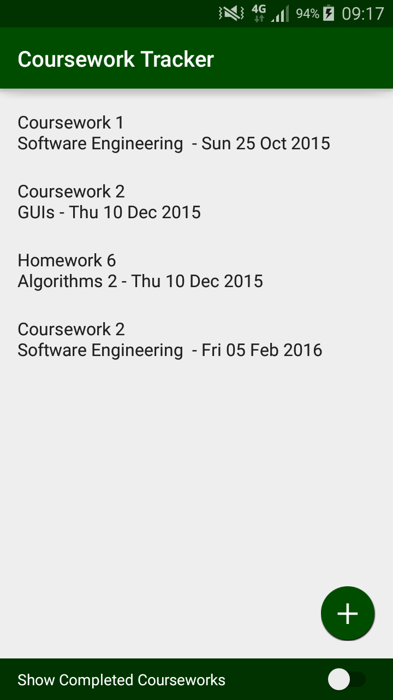
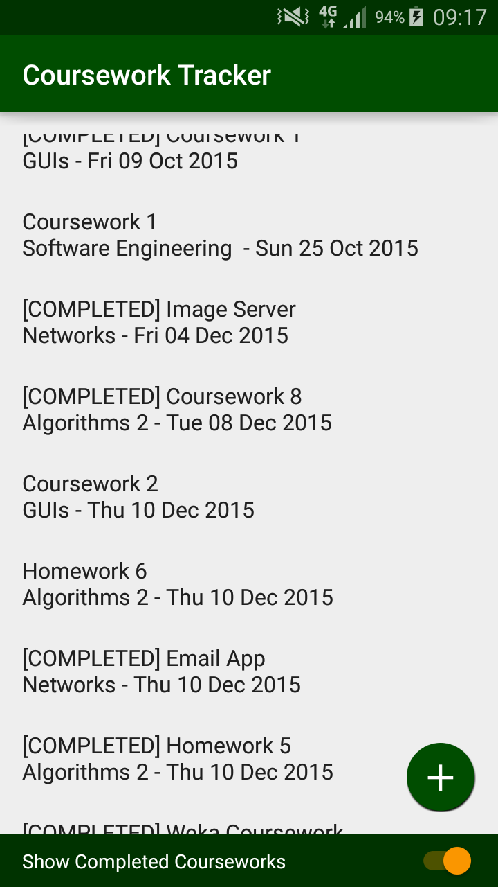
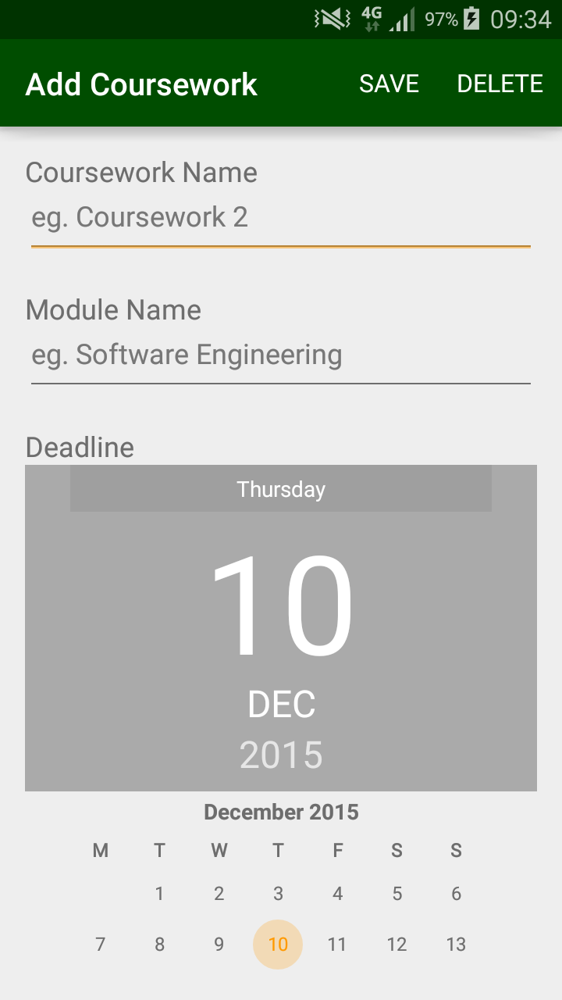
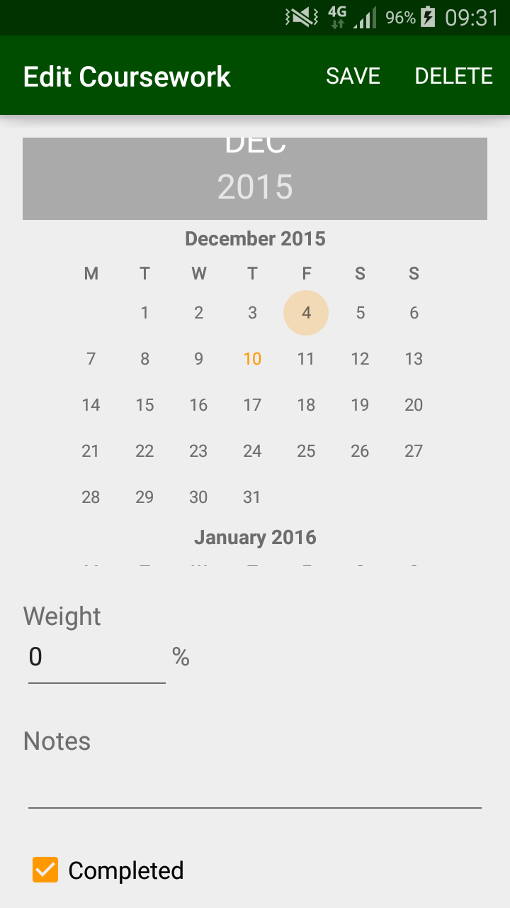

## Description
An android app to help university students keep track of outstanding courseworks. It allows them to record coursework names, deadlines, weights and notes, and check them off when they are done.

## Screenshots

## Features Used
Android GUI
- Designed using Android Studio
- Different activities are used for listing and creating/editing coursework
- Custom menu buttons for save / delete shown in the action bar
- Hints shown in text fields
- Switch used to toggle showing completed courseworks

Database Storage
- Uses a local SQLite database
- Coursework stored in the database
- User preferences also stored in the database
- Database queried using the Database class, extending SqLiteOpenHelper

## Widgets Used
- RelativeLayout
- LinearLayout
- ScrollView
- ListView
- ImageButton
- Switch
- TextView
- EditText
- DatePicker
- Checkbox
  
